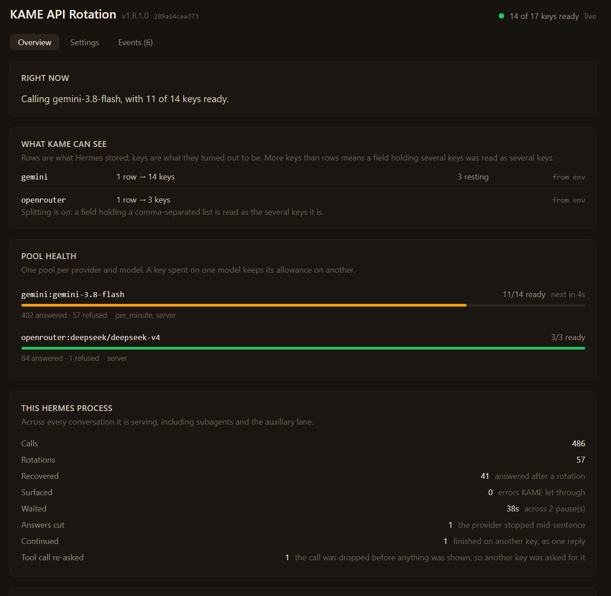
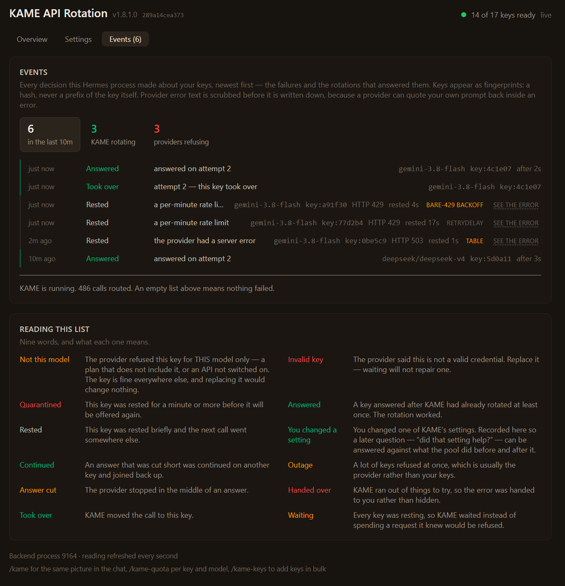
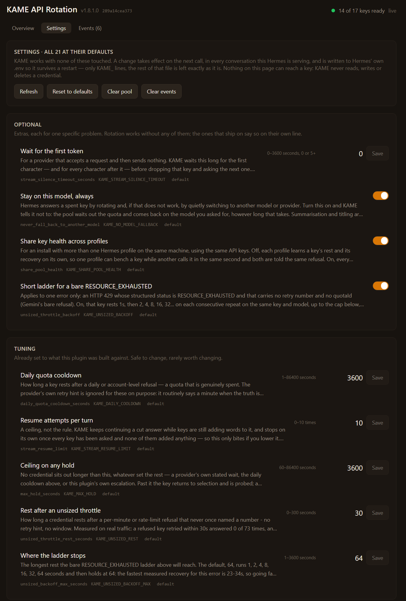

<div align="center">


# 🐢⚡ KAME — API Key Rotation for Hermes

**Paste several API keys. KAME picks the healthiest one for every call, reads every refusal, and never lets a rate limit end your turn.**

Smart API key rotation, 429 / `RESOURCE_EXHAUSTED` recovery and rate-limit failover for the [Hermes agent](https://github.com/NousResearch/hermes-agent) — Gemini, OpenAI, OpenRouter, Anthropic, or any provider.

[](CHANGELOG.md)
[](#verified)
[](#verified)
[](#verified)
[](#privacy)
[](LICENSE)
[](https://github.com/Kame696/kame-api-rotation-for-hermes/stargazers)

**[Install](#install) · [Why not round-robin](#vs) · [How it reads errors](#errors) · [Screenshots](#screens) · [Settings](#settings) · [FAQ](#faq) · [Changelog](CHANGELOG.md) · [Agent Zero version](https://github.com/Kame696/kame-api-rotation-for-agent-zero)**

</div>

---

<a id="tldr"></a>
## ⚡ In 30 seconds

- **One field, many keys.** Put `key1,key2,key3` in the provider field you already use. KAME reads it as three keys.
- **The healthiest key, every call** — not only after a failure. Fewest requests in the last 60 seconds wins, least recently used breaks the tie, so fifteen keys share the load fifteen ways.
- **It reads the error instead of guessing.** A per-minute throttle, a daily quota, an outage and a dead key are four different problems, and each gets its own wait — the provider's own number whenever it states one.
- **No key sits out longer than an hour**, and KAME never silently switches you to another model.
- **When every key is resting, it waits** for the first one back and tells you how long, instead of failing the turn.

<a id="vs"></a>
## 🆚 KAME vs round-robin

Most key rotators cycle keys in order and retry on a timer. KAME decides from the refusal itself.

| | Round-robin rotator | **KAME** |
|---|---|---|
| Which key is next | the next one in the list | **the least-loaded healthy key** (60-second window) |
| After a 429 | retry on a fixed backoff | **the provider's own `retryDelay` / `Retry-After`, to the second** |
| Per-minute vs daily quota | same treatment | **told apart** (`quotaId`, reset headers, the pool's own behaviour) |
| Gemini bare `RESOURCE_EXHAUSTED` | fixed backoff or hammering | **1 → 2 → 4 → 8s … ladder, reset the moment the key answers** |
| Outage (5xx) | punishes every key | **1s, never escalates** — the key was never at fault |
| A key spent on one model | benched everywhere | **still used on your other models** |
| All keys resting | error, turn over | **waits for the first one back, and says so** |
| Longest a healthy key can be lost | whatever the provider claimed | **1 hour** (`max_hold_seconds`) |

<a id="install"></a>
## 🚀 Install

```bash
hermes plugins install Kame696/kame-api-rotation-for-hermes/hermes-kame-api-rotation
hermes plugins enable hermes-kame-api-rotation
```

Then **restart Hermes** once. For the Desktop panel and the status-bar chip, turn on **KAME API Rotation** in Desktop **Settings → Plugins** (the panel ships inside the package at `desktop/plugin.js`; Desktop keeps it off until you say so).

| | |
|---|---|
| **Needs** | Hermes, and nothing else — no third-party package |
| **Works without the Desktop** | yes; rotation is CLI- and gateway-safe, the panel is extra |
| **Turn it off without uninstalling** | `KAME_ROTATION_DISABLED=1`, or the first switch in the panel |

<a id="keys"></a>
## 🔑 Add your keys

Paste them into **one** provider field, separated by commas — in the dashboard or in `~/.hermes/.env`:

```
GOOGLE_API_KEY=AIzaSy...aaa,AIzaSy...bbb,AIzaSy...ccc
```

That is all KAME needs. One key works too; there is just nothing to rotate to.

<details>
<summary><b>Bulk import from any chat, including the Android app</b></summary>

```
/kame-keys add AIza...,AIza...,AIza...
/kame-keys add openrouter sk-or-...,sk-or-...
/kame-keys import ~/keys.txt
/kame-keys                       show pooled keys and their health
/kame-keys reset                 clear exhaustion, re-enable every key
```

Commas, spaces, newlines, semicolons and pipes all separate keys. Keys already pooled are skipped. A key is never echoed back — every message shows it as `AIzaSy…q7R8`. Pasting keys into a chat puts them in that chat's transcript; `import <file>` avoids that.

`add` and `import` write the new keys to `~/.hermes/auth.json` (Hermes' own credential store). Before each write KAME saves a plaintext copy of the previous file beside it as `auth.json.kame-<timestamp>.bak`, keeping the last 5 — those backups hold your keys in plain text, like `auth.json` itself.
</details>

<a id="errors"></a>
## 🧠 How KAME reads every error

Every refusal is sized from what the provider actually sent. Decisions are made on the payload, never on the provider's name, so a provider that did not exist when this was written is covered by the same rules.

| The provider says | KAME does |
|---|---|
| **429 with a stated wait** (`retryDelay`, `Retry-After`, a reset header or time) | rests that key **exactly that long**, up to the 1-hour ceiling |
| **Gemini `429 RESOURCE_EXHAUSTED`, no number at all** | rests it **1s, then 2, 4, 8, 16, 32, 64s** on each repeat; back to 1s the moment it answers |
| **Any other throttle with no number** | a short flat rest, **20–30s** — measured: retried within 30s, a refused key answered 0 of 73 times |
| **A daily quota** (e.g. `PerDay` in `quotaId`) | re-probes in **5 minutes** while other keys still answer; rests **1 hour** once the whole pool has been silent for 20 minutes |
| **An account-wide limit** (a subscription cap) | benches that credential on **every model** of the provider, up to the ceiling |
| **Out of credit** | **1 hour** — a person has to top it up |
| **5xx / overloaded** | **1 second**, never escalates — an outage is not the key's fault |
| **Timeout / dropped connection** | moves to the next key; the key is not rested at all |
| **Bare 401** | 20s, offered last, out of rotation after 3 in a row |
| **"This key is invalid / revoked"** | out of rotation at once — replace it and it comes back by itself |
| **403 for one model only** | that key skips that model and keeps working on the others |
| **An answer cut mid-stream** | continued on another key and joined back into one reply |
| **Anything it cannot size** | left to Hermes' own classifier, unchanged |

<a id="screens"></a>
## 🖥️ What you see

**The status-bar chip**, always on screen — the pool being called first:

```
●  KAME  gemini:gemini-3.8-flash 11/14 4s   openrouter:deepseek/deepseek-v4 3/3
```

**The panel** (`/kame`, or *KAME API Rotation* in the sidebar) — **POOL HEALTH** per provider and model, what each key is doing, every decision and where its number came from:

<p align="center"></p>

<details>
<summary><b>Events — every rotation, and where each wait came from</b></summary>

<p align="center"></p>
</details>

<details>
<summary><b>Settings — three labelled shelves, live, no restart</b></summary>

<p align="center"></p>
</details>

<sub>Rendered from the plugin's own panel code with sample data. Keys appear only as fingerprints, so every screen is safe to share.</sub>

<a id="settings"></a>
## ⚙️ Settings

Nothing needs changing. Every setting is in the panel, in `/kame set`, and as an environment variable (the environment wins).

<details>
<summary><b>The ones worth knowing</b></summary>

| Setting | Default | What it does |
|---|---|---|
| `max_hold_seconds` | `3600` | No key sits out longer than this, whatever caused the hold |
| `unsized_throttle_backoff` | on | The 1-2-4-8s ladder for Gemini's bare `RESOURCE_EXHAUSTED` |
| `unsized_backoff_max_seconds` | `64` | Where that ladder stops growing |
| `unsized_throttle_rest_seconds` | `30` | Rest after any other throttle that names no wait |
| `daily_quota_cooldown_seconds` | `3600` | Rest once a daily quota is confirmed by a silent pool |
| `never_fall_back_to_another_model` | on | Wait out a quota on your model instead of silently switching |
| `share_pool_health` | on | Several Hermes profiles with the same keys share one health file |
| `stream_resume_limit` | `10` | How often a cut answer may be continued on another key |
| `stream_silence_timeout_seconds` | `0` (off) | Drop a key that accepts a request and then sends nothing |
| `disabled` | off | Turn KAME off without uninstalling (`KAME_ROTATION_DISABLED=1`) |

The panel explains every one of them in full, with its environment variable.
</details>

<a id="commands"></a>
## 💬 Commands

| Command | What it answers |
|---|---|
| `/kame` | Pool health, this process's counters, what is resting and until when, and the build fingerprint |
| `/kame doctor` | Is it rotating correctly? Every kind of refusal beside the rest it got, and anything only a person can fix |
| `/kame get` · `/kame set <key> <value>` · `/kame reset <key>` | Read and change settings, live |
| `/kame events` | The latest rotations, rests and cut streams |
| `/kame-quota` | The quota picture per key and per model |
| `/kame-keys` | Add and inspect pooled keys in bulk |

<a id="privacy"></a>
## 🔒 Privacy

- **KAME never prints, logs or sends a key.** Screens and files carry fingerprints and counts only.
- **No telemetry, no network call of its own, no third-party package.**
- **It asks Hermes for no special permission** — no tool override, no model override, nothing to grant.
- Its local logs (`refusals.jsonl`, `calls.jsonl`) hold provider refusals and timings with keys redacted, and each can be switched off.

<a id="verified"></a>
## ✅ Verified

| Check | Result |
|---|---|
| Offline test suite | **2,834 passing** |
| `hermes plugins validate` (the Hermes catalog's admission check) | **passes; security scan: safe** |
| Hermes' own credential-pool test suite, with and without KAME | **identical** on Hermes 0.21.1 and 0.21.3, apart from the load spreading KAME exists to add |
| Hermes' own error-classification corpus, with and without KAME | changes only the 5 verdicts it changes on purpose, each documented |
| Runtime contracts against the real Hermes turn loop | **12 / 12**, each proven able to fail |
| Real use | the author's own traffic: 14 Gemini keys plus other providers, every day |

<a id="faq"></a>
## ❓ FAQ

<details>
<summary><b>Does it work with OpenAI, Anthropic, OpenRouter — not just Gemini?</b></summary>

Yes. KAME decides from the refusal — retry timing, rate-limit headers, the shape of the error body — never from who the provider is.
</details>

<details>
<summary><b>Why does Gemini say <code>RESOURCE_EXHAUSTED</code> on every key at once?</b></summary>

Gemini's quotas are per Google Cloud project, and a bare `429 RESOURCE_EXHAUSTED` with no `quotaId` and no `retryDelay` often arrives on many keys at the same moment and clears on all of them together — which points at a busy model rather than at your quota. KAME retries those keys on a short 1-2-4-8s ladder instead of benching them, and the first key that answers resets its own ladder.
</details>

<details>
<summary><b>A key was rested for an hour. Is that a bug?</b></summary>

Only a confirmed daily quota or an empty balance rests a key that long. A daily label alone buys a 5-minute re-probe; the hour applies once the whole pool has gone 20 minutes without a single answer. Nothing is ever held longer than `max_hold_seconds`.
</details>

<details>
<summary><b>Do I need to restart Hermes?</b></summary>

Once, after installing. After that every setting — panel, `/kame set` or a `KAME_*` variable — applies on the next call.
</details>

<details>
<summary><b>I only have one key. Does KAME help?</b></summary>

Yes: the right wait for each error, stream continuation, the live countdown and the one-hour ceiling all apply. It simply has nothing to rotate to.
</details>

<details>
<summary><b>How do I know it is actually running?</b></summary>

`/kame` and the panel header show a 12-character build fingerprint computed from the files on disk. If a part of the plugin is missing, the panel says so in the loudest line on the page.
</details>

---

<a id="agent-zero"></a>
## 🐢 Also for Agent Zero

The same engine, ported to [Agent Zero](https://github.com/agent0ai/agent-zero): **[kame-api-rotation-for-agent-zero](https://github.com/Kame696/kame-api-rotation-for-agent-zero)**.

## ❤️ Support

KAME is free, MIT, and built by one person against real quotas. No company, no telemetry, nothing to upsell. If it saved you a run, a tip keeps it going:

**Bitcoin** — `36BGYhMEVFgY8PLGMVux93pjGt92KVM6dJ`

And a ⭐ costs nothing and helps other people find it.

## 📜 License

MIT — see [LICENSE](LICENSE). Bugs and ideas: [issues](https://github.com/Kame696/kame-api-rotation-for-hermes/issues).

<div align="center">

🐢⚡ **KAME 1.8.1.0** — *because round-robin was never enough*

</div>
