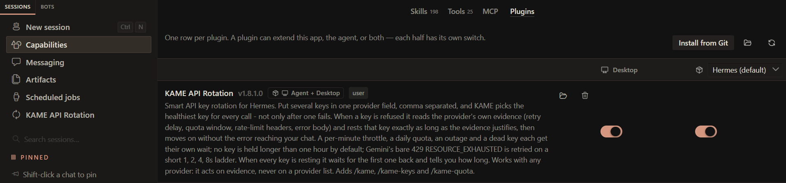
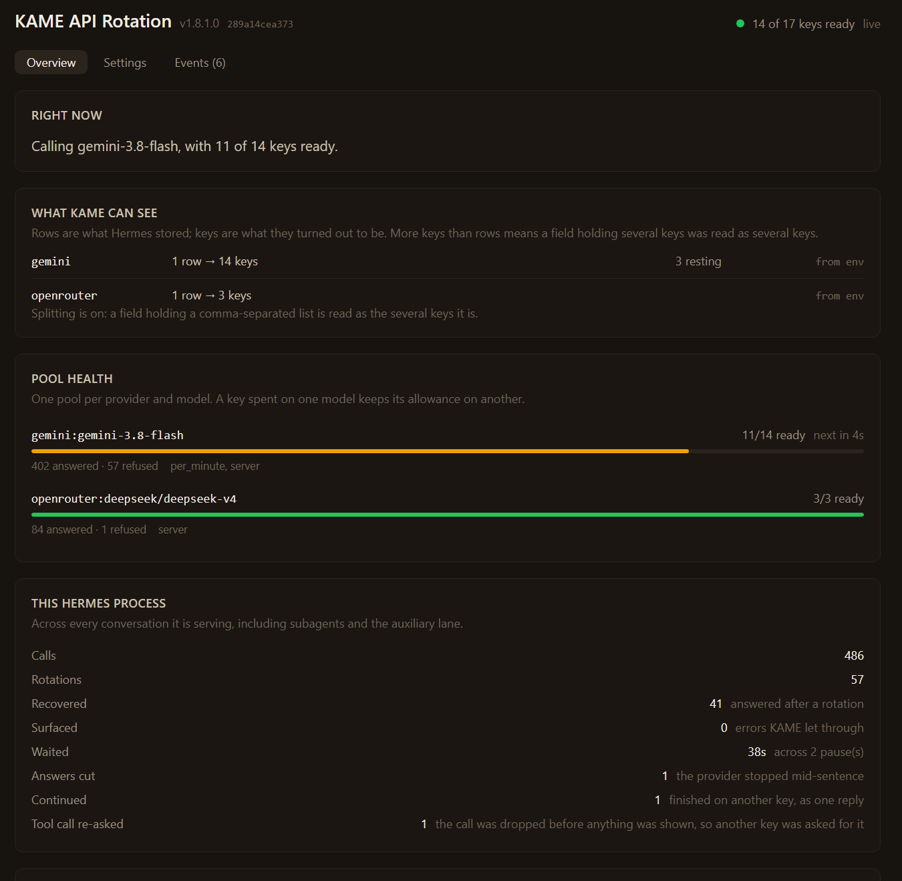
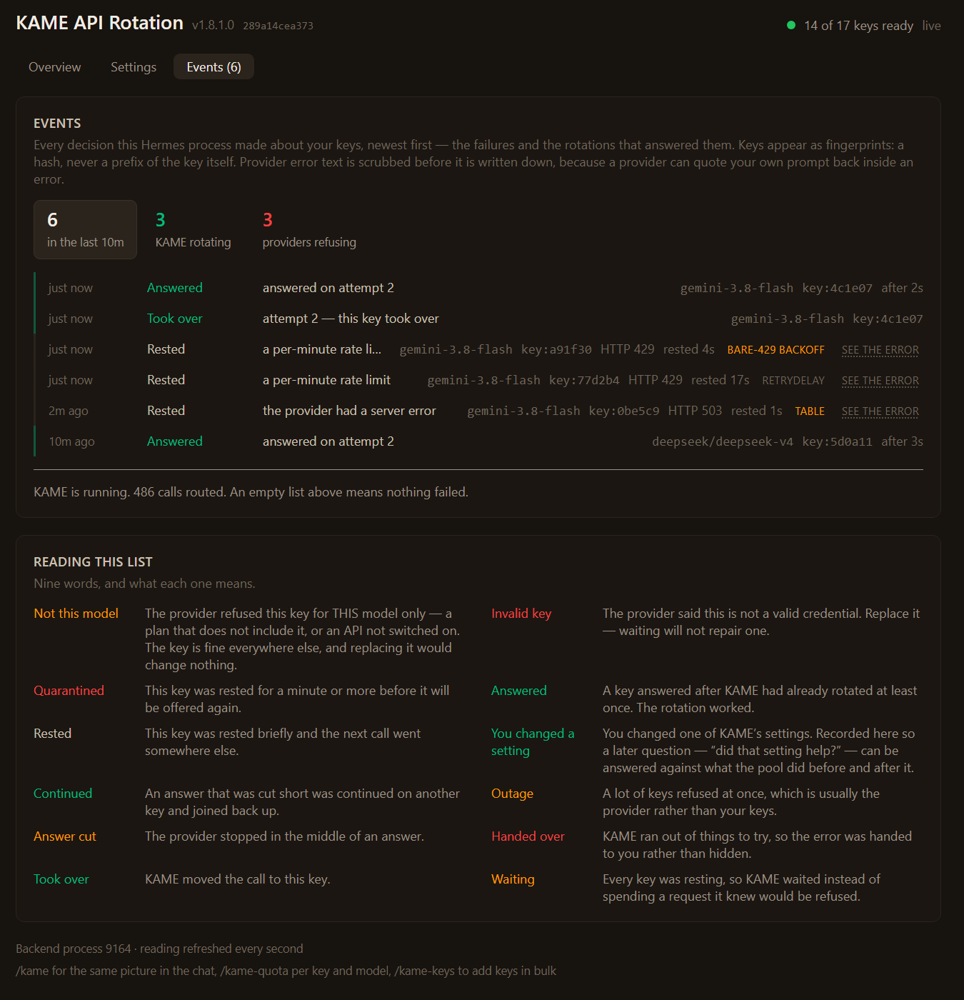
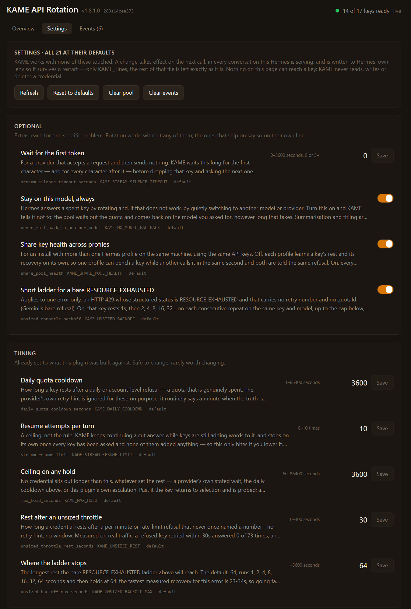

<div align="center">


# 🐢⚡ KAME — API Key Rotation for Hermes

**Paste several API keys. KAME picks the healthiest one for every call, reads every refusal, and keeps recoverable rate limits from prematurely ending your turn.**

Smart API key rotation, 429 / `RESOURCE_EXHAUSTED` recovery and rate-limit failover for the [Hermes agent](https://github.com/NousResearch/hermes-agent) — Gemini, OpenAI, OpenRouter, Anthropic, or any provider.

[](CHANGELOG.md)
[](#verified)
[](#verified)
[](#verified)
[](#privacy)
[](LICENSE)
[](https://github.com/Kame696/kame-api-rotation-for-hermes/stargazers)

**[Install](#install) · [Why not round-robin](#vs) · [How it reads errors](#errors) · [Screenshots](#screens) · [Settings](#settings) · [FAQ](#faq) · [Version history](#history) · [Changelog](CHANGELOG.md) · [Agent Zero version](https://github.com/Kame696/kame-api-rotation-for-agent-zero)**

</div>

**1.8.1.9 — the same carousel, with no runtime overrides of Hermes.** Plugin
catalog rule 9 asks listed plugins not to replace, wrap or rebind Hermes core;
1.8.1.8 did, and its catalog update was closed for it
([#131918](https://github.com/NousResearch/hermes-agent/pull/131918)). 1.8.1.9
removes every rebind. Hermes asks a provider profile for its model client
(`ProviderProfile.create_client`, the documented way to bring a transport), and
the companion package `hermes-kame-provider` answers with a client that rotates
your keys. Every rotation, wait, refusal-sizing and continuation decision is
1.8.1.8's, moved unchanged. `hermes plugins validate` passes both packages with
no warnings.

Measured on real Hermes turns against local fake providers, six scenarios on
every wire (native Gemini, OpenAI chat completions, Anthropic Messages,
Responses API): the same turns answered as 1.8.1.8, steady turns faster, no
repeated text after a cut answer, and a cut Anthropic answer continued on
another key instead of restarted. The status line (`⏳ waiting on … — KAME
13/15 keys healthy`) is on every surface again through Hermes'
`notify_turn_status`. See
[validation and limitations](VALIDATION.md) and [release notes](CHANGELOG.md).

---

<a id="tldr"></a>
## ⚡ In 30 seconds

- **One field, many keys.** Put `key1,key2,key3` in the provider field you already use. KAME reads it as three keys.
- **The healthiest key, every call** — not only after a failure. Fewest requests in the last 60 seconds wins, least recently used breaks the tie, so fifteen keys share the load fifteen ways.
- **It reads the error instead of guessing.** A per-minute throttle, a daily quota, an outage and a dead key are four different problems, and each gets its own wait — the provider's own number whenever it states one.
- **No key sits out longer than an hour**, and KAME never silently switches you to another model.
- **When every key is resting, it waits** for the first one back and tells you how long, instead of failing the turn.

<a id="vs"></a>
## 🆚 KAME vs round-robin

Most key rotators cycle keys in order and retry on a timer. KAME decides from the refusal itself.

| | Round-robin rotator | **KAME** |
|---|---|---|
| Which key is next | the next one in the list | **the least-loaded healthy key** (60-second window) |
| After a 429 | retry on a fixed backoff | **the provider's own `retryDelay` / `Retry-After`, to the second** |
| Per-minute vs daily quota | same treatment | **told apart** (`quotaId`, reset headers, the pool's own behaviour) |
| Gemini bare `RESOURCE_EXHAUSTED` | fixed backoff or hammering | **1 → 2 → 4 → 8s … ladder, reset the moment the key answers** |
| Outage (5xx) | punishes every key | **1s, never escalates** — the key was never at fault |
| A key spent on one model | benched everywhere | **still used on your other models** |
| All keys resting | error, turn over | **waits for the first one back, and says so** |
| Longest a healthy key can be lost | whatever the provider claimed | **1 hour** (`max_hold_seconds`) |

<a id="install"></a>
## 🚀 Install

```bash
hermes plugins install Kame696/kame-api-rotation-for-hermes/hermes-kame-api-rotation
hermes plugins install Kame696/kame-api-rotation-for-hermes/hermes-kame-provider
hermes plugins enable hermes-kame-api-rotation
```

Both are needed: `hermes-kame-api-rotation` is the carousel, the commands and the panel; `hermes-kame-provider` (a `model-provider` plugin, loaded by Hermes on its own) is how Hermes asks it for a client. Either one alone changes nothing — Hermes builds its usual client.

Then **restart Hermes** once. For the Desktop panel and the status-bar chip, turn on **KAME API Rotation** in Desktop **Settings → Plugins** (the panel ships inside the package at `desktop/plugin.js`; Desktop keeps it off until you say so — [step by step, with a screenshot](#panel)).

| | |
|---|---|
| **Needs** | Hermes 0.21.4 or newer, and nothing else — no third-party package |
| **Works without the Desktop** | yes; rotation is CLI- and gateway-safe, the panel is extra |
| **Turn it off without uninstalling** | `KAME_ROTATION_DISABLED=1`, or the first switch in the panel |

<a id="keys"></a>
## 🔑 Add your keys

Paste them into **one** provider field, separated by commas — in the dashboard or in `~/.hermes/.env`:

```
GOOGLE_API_KEY=AIzaSy...aaa,AIzaSy...bbb,AIzaSy...ccc
```

That is all KAME needs. One key works too; there is just nothing to rotate to.

KAME keeps such a list as one pool entry per key on its own, at every start, and follows the variable when you edit it (turn off with `resolver_disabled`). It writes through Hermes' own pool API, suppresses the comma source, backs up `auth.json` first, and never rewrites `.env`. `/kame-keys split` does the same once by hand.

<details>
<summary><b>Bulk import from any chat, including the Android app</b></summary>

```
/kame-keys add AIza...,AIza...,AIza...
/kame-keys add openrouter sk-or-...,sk-or-...
/kame-keys import ~/keys.txt
/kame-keys                       show pooled keys and their health
/kame-keys reset                 clear exhaustion, re-enable every key
```

Commas, spaces, newlines, semicolons and pipes all separate keys. Keys already pooled are skipped. A key is never echoed back — every message shows it as `AIzaSy…q7R8`. Pasting keys into a chat puts them in that chat's transcript; `import <file>` avoids that.

`add`, `import` and `split` write the new keys to `~/.hermes/auth.json` (Hermes' own credential store). Before each write KAME saves a plaintext copy of the previous file beside it as `auth.json.kame-<timestamp>.bak`, keeping the last 5 — those backups hold your keys in plain text, like `auth.json` itself.
</details>

<a id="panel"></a>
## 🖥️ Turn on the panel (optional)

Rotation works as soon as your keys are in. The Desktop panel and the sidebar entry are extra, and Desktop keeps them **off until you turn them on**:

1. In Hermes Desktop open **Capabilities → Plugins**.
2. Find **KAME API Rotation** and switch on **Desktop** (the *Agent* switch is the rotation itself).
3. **KAME API Rotation** appears in the left sidebar, with the status chip in the bar.

<p align="center"></p>

<a id="errors"></a>
## 🧠 How KAME reads every error

Every refusal is sized from what the provider actually sent. Decisions are made on the payload, never on the provider's name, so a provider that did not exist when this was written is covered by the same rules.

| The provider says | KAME does |
|---|---|
| **429 with a stated wait** (`retryDelay`, `Retry-After`, a reset header or time) | rests that key **exactly that long**, up to the 1-hour ceiling |
| **Gemini `429 RESOURCE_EXHAUSTED`, no number at all** | rests it **1s, then 2, 4, 8, 16, 32, 64s** on each repeat; back to 1s the moment it answers |
| **Any other throttle with no number** | a short flat rest, **20–30s** — measured: retried within 30s, a refused key answered 0 of 73 times |
| **A daily quota** (e.g. `PerDay` in `quotaId`) | re-probes in **5 minutes** while other keys still answer; rests **1 hour** once the whole pool has been silent for 20 minutes |
| **An account-wide limit** (a subscription cap) | benches that credential on **every model** of the provider, up to the ceiling |
| **Out of credit** | **1 hour** — a person has to top it up |
| **5xx / overloaded** | **1 second**, never escalates — an outage is not the key's fault |
| **Timeout / dropped connection** | moves to the next key; the key is not rested at all |
| **Bare 401** | 20s, offered last, out of rotation after 3 in a row |
| **"This key is invalid / revoked"** | out of rotation at once — replace it and it comes back by itself |
| **403 for one model only** | that key skips that model and keeps working on the others |
| **An answer cut mid-stream** | continued on another key and joined back into one reply |
| **Anything it cannot size** | left to Hermes' own classifier, unchanged |

<a id="screens"></a>
## 🖥️ What you see

**The status-bar chip**, always on screen — the pool being called first:

```
●  KAME  gemini:gemini-3.8-flash 11/14 4s   openrouter:deepseek/deepseek-v4 3/3
```

**The in-chat line** above the Desktop message box while a call waits or is being continued — `⏳ waiting on gemini:gemini-3.8-flash — KAME 13/15 keys healthy`. (CLI, TUI and gateway clients have no plugin channel for it; the chip, `/kame` and `/kame-quota` show the same state.)

**The panel** (`/kame`, or *KAME API Rotation* in the sidebar) — **POOL HEALTH** per provider and model, what each key is doing, every decision and where its number came from:

<p align="center"></p>

<details>
<summary><b>Events — every rotation, and where each wait came from</b></summary>

<p align="center"></p>
</details>

<details>
<summary><b>Settings — three labelled shelves, live, no restart</b></summary>

<p align="center"></p>
</details>

<sub>Rendered from the plugin's own panel code with sample data. Keys appear only as fingerprints, so every screen is safe to share.</sub>

<a id="settings"></a>
## ⚙️ Settings

Nothing needs changing. Every setting is in the panel, in `/kame set`, and as an environment variable (the environment wins).

<details>
<summary><b>The ones worth knowing</b></summary>

| Setting | Default | What it does |
|---|---|---|
| `max_hold_seconds` | `3600` | No key sits out longer than this, whatever caused the hold |
| `unsized_throttle_backoff` | on | The 1-2-4-8s ladder for Gemini's bare `RESOURCE_EXHAUSTED` |
| `unsized_backoff_max_seconds` | `64` | Where that ladder stops growing |
| `unsized_throttle_rest_seconds` | `30` | Rest after any other throttle that names no wait |
| `daily_quota_cooldown_seconds` | `3600` | Rest once a daily quota is confirmed by a silent pool |
| `never_fall_back_to_another_model` | on | Wait out a quota on your model instead of silently switching |
| `share_pool_health` | on | Several Hermes profiles with the same keys share one health file |
| `stream_resume_limit` | `-1` (automatic) | Continue while new answer content arrives; `0` disables recovery, `1`–`10` set an explicit ceiling |
| `stream_silence_timeout_seconds` | `0` (off) | Drop a key that accepts a request and then sends nothing |
| `disabled` | off | Turn KAME off without uninstalling (`KAME_ROTATION_DISABLED=1`) |

The panel explains every one of them in full, with its environment variable.
</details>

<a id="commands"></a>
## 💬 Commands

| Command | What it answers |
|---|---|
| `/kame` | Pool health, this process's counters, what is resting and until when, and the build fingerprint |
| `/kame doctor` | Is it rotating correctly? Every kind of refusal beside the rest it got, and anything only a person can fix |
| `/kame get` · `/kame set <key> <value>` · `/kame reset <key>` | Read and change settings, live |
| `/kame events` | The latest rotations, rests and cut streams |
| `/kame-quota` | The quota picture per key and per model |
| `/kame-keys` | Add and inspect pooled keys in bulk; `split` gives each key of a comma list its own pool entry |

<a id="privacy"></a>
## 🔒 Privacy

- **KAME never prints, logs or sends a key.** Screens and files carry fingerprints and counts only.
- **No telemetry, no network call of its own, no third-party package.**
- **It asks Hermes for no special permission** — no tool override, no model override, nothing to grant.
- Its local logs (`refusals.jsonl`, `calls.jsonl`) hold provider refusals and timings with keys redacted, and each can be switched off.

<a id="verified"></a>
## ✅ Verified

1.8.1.9, all offline — local fake providers, no real key, no real request. Details in [VALIDATION.md](VALIDATION.md).

| Check | Result |
|---|---|
| `hermes plugins validate` (both packages) | **ok, no warnings** — `no core override` and `desktop surface` included |
| Real Hermes turns vs 1.8.1.8, six scenarios × two wires | **same turns answered, same requests per key**; faster steady turns on the OpenAI wire; no repeated text after a cut answer |
| Hermes' own 25 suites with KAME's client in every test home | **no unexpected divergence**; one real gap found this way and fixed (auxiliary NVIDIA calls lacked Hermes' billing header) |
| Host gates (classifier corpus, prose, host facts, Gemini contracts, clock, continuity) | **all pass**; the 200-case corpus keeps its five documented intentional differences |
| Plugin suite | **2,772 passing** with Hermes on the path; public checkout offline result in [VALIDATION.md](VALIDATION.md); 361 1.8.1.8 tests whose subject is gone retired one by one, each with its reason |
| Python 3.11 (Hermes' own interpreter) | every module compiles; the 1.8.1.9 transport, client and invariant tests pass |

### Historical validation (not a new-build certification)

1.8.1.6 was installed in the author's running Hermes 0.21.3 gateway (all
three profiles): real agent turns on Gemini 3.8 and NVIDIA Kimi K3 answered
16 of 16, and a replay of 2,634 recorded refusals through 1.8.1.2 and 1.8.1.6
changed no decision. 1.8.1.2 was validated on the running Hermes gateway with real agent turns on
Gemini 3.8 and NVIDIA Kimi K3 across a real daily-quota wall and reset, with a
separate probe measuring how Gemini's per-minute and per-day limits behave.
Daily-traffic evidence and the 0.21.1 gate belong to earlier builds;
Agent Zero runtime validation remains separate. 1.8.1.3 re-ran every offline
host witness in `tools/` against Hermes 0.21.3, 0.21.4 and 0.21.5 installed
from their release tags; it changes no runtime behaviour, so the live-gateway
evidence above still describes what runs.

<a id="faq"></a>
## ❓ FAQ

<details>
<summary><b>Does it work with OpenAI, Anthropic, OpenRouter — not just Gemini?</b></summary>

Yes. KAME decides from the refusal — retry timing, rate-limit headers, the shape of the error body — never from who the provider is.

The whole carousel runs inside the call on every API-key wire: chat completions (Gemini, OpenRouter, NVIDIA, DeepSeek, custom OpenAI-compatible endpoints and the rest), the Responses API (`api.openai.com`, xAI) and Anthropic Messages (Anthropic, MiniMax, Kimi coding). Least-loaded key first, waits, continuation of a cut answer (except on the Responses API, as in 1.8.1.8). Anthropic Messages needs a Hermes that offers `create_messages_client`; an older one builds its own Messages client, and KAME still sizes every refusal there.
</details>

<details>
<summary><b>Why does Gemini say <code>RESOURCE_EXHAUSTED</code> on every key at once?</b></summary>

Gemini's quotas are per Google Cloud project, and a bare `429 RESOURCE_EXHAUSTED` with no `quotaId` and no `retryDelay` often arrives on many keys at the same moment and clears on all of them together — which points at a busy model rather than at your quota. KAME retries those keys on a short 1-2-4-8s ladder instead of benching them, and the first key that answers resets its own ladder.
</details>

<details>
<summary><b>A key was rested for an hour. Is that a bug?</b></summary>

Only a confirmed daily quota or an empty balance rests a key that long. A daily label alone buys a 5-minute re-probe; the hour applies once the whole pool has gone 20 minutes without a single answer. Nothing is ever held longer than `max_hold_seconds`.
</details>

<details>
<summary><b>Do I need to restart Hermes?</b></summary>

Once, after installing. After that every setting — panel, `/kame set` or a `KAME_*` variable — applies on the next call.
</details>

<details>
<summary><b>I only have one key. Does KAME help?</b></summary>

Yes: the right wait for each error, stream continuation, the live countdown and the one-hour ceiling all apply. It simply has nothing to rotate to.
</details>

<details>
<summary><b>How do I know it is actually running?</b></summary>

`/kame` and the panel header show a 12-character build fingerprint computed from the files on disk. If a part of the plugin is missing, the panel says so in the loudest line on the page.
</details>

---

<a id="history"></a>
## 🪪 Version history

The previous README had an **Evolution** table. It disappeared during the
1.8.1.0 README rewrite; the plugin's older work did not disappear. Restored
below with the newer milestones added. The 1.7.x and 1.8.0.x entries were
development candidates, not public release tags; 1.8.1.3–1.8.1.5 shipped together
inside the v1.8.1.6 release. See [CHANGELOG.md](CHANGELOG.md)
for the full notes on the current public releases.

<details>
<summary><b>Versions and what changed (click to open)</b></summary>

| Version | Focus | What changed |
|---|---|---|
| **1.8.1.9** | No runtime overrides | Every rebind of Hermes core removed for catalog rule 9; the carousel now runs inside the client Hermes asks a provider profile for (companion package `hermes-kame-provider`). Same decisions as 1.8.1.8 on real Hermes turns, on every wire (Anthropic Messages and Responses through new provider-profile clients); status line through `notify_turn_status`; comma-joined key variables kept as one pool row per key automatically; two settings retired because Hermes now does their job. |
| **1.8.1.8** | Serial reliability | Independent profile leases and stoppable heartbeats; progress-based continuation, exact stream boundaries and original-request incomplete-tool replay; writer-owned snapshot cache and defensive Desktop formatting. Engine retained, no request racing; catalog update needs renewed review. |
| **1.8.1.7** | Reproducible verification *(local candidate)* | Deterministic Windows clock regressions, paired 1/2/14-key overhead measurement, live-key and isolated Hermes acceptance, byte-exact ZIP verification, and explicit current catalog admission dependency. Existing runtime features retained. |
| **1.8.1.6** | One hour means one hour | `max_hold_seconds` now bounds every hold, the provider's own included: a 24h `Retry-After`, a "try again in 6h" in the message or Codex's reset used to keep a key out that long; it comes back at the ceiling (one hour unless you change it) and is simply held again if the provider still refuses. Lowering the ceiling also applies to holds already running. |
| **1.8.1.5** | The ceiling holds, whatever the clock does *(inside the v1.8.1.6 release)* | No key sits out longer than `max_hold_seconds` any more when the computer's clock steps back (a 30s rest had become two hours), and a longer hold set by another Hermes profile is now actually released at this profile's ceiling instead of only being reported as if it were. A provider number too large to read, a damaged shared pool-health file or `/kame set … nan` no longer end a turn, turn sharing off for good or print a traceback. |
| **1.8.1.4** | Safer with your keys, wiser about errors *(inside the v1.8.1.6 release)* | Hermes' `.env` can no longer be left half-written (a failed write used to lose keys); key backups are owner-only from the first byte. A context-too-long error is no longer mistaken for a rate limit because a token count contains 429; a rate limit is never mistaken for the end of the turn; a flagged prompt is not resent on every key. Anthropic per-model 429s on Hermes 0.21.4+ rest 30s, not an hour, and show in `/kame events`. Same decisions as Agent Zero on 860 of 877 recorded refusal shapes (the rest are documented). |
| **1.8.1.3** | Checked against Hermes 0.21.4 and 0.21.5 *(inside the v1.8.1.6 release)* | No runtime change. Every host witness passes on 0.21.3–0.21.5; four of them were fixed where they mistook a reformatted or reorganised Hermes for a broken one; the gate tests read this run's evidence instead of stale files; CI workflows added. |
| **1.8.1.2** | The provider's number wins again | A wait the provider states in prose or a body field ("try again in 7s", Codex `resets_in_seconds`) is obeyed again instead of a flat 30s; a billing refusal no wait fixes ends the turn once every key said so; same decisions as Agent Zero on all 1,984 recorded refusals. |
| **1.8.1.1** | Reliability patch | Reset reports persistence failures; account holds, per-call timeout, classification and redaction are hardened. |
| **1.8.1.0** | Error evidence | Refusals are sized from provider evidence; Gemini's bare 429 uses a 1–64s ladder, daily labels re-probe, 5xx stays short. |
| **1.8.0.2** | Corrected measurement | An unsized throttle rests 30s, correcting the earlier double-counted 45s estimate. |
| **1.8.0.1** | First live 429 measurement | Added a configurable unsized rest after observing no successful retry below 30s; its 45s default was later corrected. |
| **1.8.0.0** | Bounded, shared health | One-hour maximum hold, shared health across profiles, account-wide limits and timeout rotation. |
| **1.7.0.6** | Scope and timing | Daily inference stays with its account; subscription reset fields and elapsed-time reporting are corrected. |
| **1.7.0.5** | Complete Events labels | Source chips appear for all supported cooldown evidence labels. |
| **1.7.0.4** | Server errors stay short | Repeated 5xx responses no longer climb a cooldown ladder. |
| **1.7.0.3** | Milliseconds are milliseconds | A retry hint ending in `ms` no longer becomes a wait measured in minutes. |
| **1.7.0.2** | Daily-label re-probe | A daily quota label triggers a short re-probe, not an automatic one-hour hold. |
| **1.7.0.1** | Distinct key identities | Multi-key credentials no longer share one health identity. |
| **1.7.0.0** | Rebuilt error reader | Refusal rules were rebuilt against recorded errors and an independent answer key. |
| **1.6.0.4** | Thinking is not an answer | Reasoning tokens no longer suppress rotation after an empty answer. |
| **1.6.0.3** | Honor stated waits | Provider retry hints no longer get multiplied by prior failures. |
| **1.6.0.2** | Evidence precedence | Stronger quota evidence is no longer overridden by weaker or absent signals. |
| **1.6.0.1** | Multi-process status | Desktop and gateway keep separate status sections; invalid-key and model-only refusals are handled distinctly. |
| **1.6.0.0** | Host integration | Pool holds, streamed continuations and the visible panel follow Hermes' real call path. |
| **1.5.0** | Exception evidence | The exception type is read; transport failures rest briefly and Settings avoids a disabled-controls freeze. |
| **1.4.0** | Machine-readable cooldowns | Structured provider fields size waits; Events names their source. |
| **1.3.3** | Rotate on stream drops | An unstitched mid-stream connection loss rotates rather than ending the turn. |
| **1.3.2** | Exhausted-pool handling | A pool of 429s waits instead of crashing; terminal failures reach Events and the UI. |
| **1.3.1** | Gemini stream hotfix | A response body that cannot be read no longer crashes error classification. |
| **1.3.0** | Terminal-error shield | Non-retryable errors stop cleanly; payload inspection opens in the Desktop UI. |
| **1.2.9** | Correct provider names | NVIDIA and other providers are no longer classified under a hard-coded Gemini name. |
| **1.2.8** | Quieter rotation | Status says `rotating…` rather than flickering through key names. |
| **1.2.7** | Empty 429 bodies | A throttle without exception text no longer becomes a zero-second rest. |
| **1.2.6** | Header-based waiting | Modern classification is wired into the dispatch path. |
| **1.2.5** | Outage handling | Adaptive storm timeout, circuit breaker and less blocking between concurrent agents. |
| **1.2.4** | Daily cap fix | Removed the US/Pacific midnight guess that over-held Google keys. |
| **1.2.3** | Stable Settings form | Saving no longer remounts the form under the cursor. |
| **1.2.2** | Pool mirrors config | A removed key stops being retried and a comma-joined row is not sent as one key. |
| **1.2.1** | Gemini stream recovery | SDK-wrapped stream read timeouts rotate instead of ending the turn. |
| **1.2.0** | Readable Settings | Three labelled shelves distinguish core rotation from optional extras. |
| **1.1.3** | Avoid needless benching | The only healthy key is not benched by a rest that buys nothing. |
| **1.1.2** | Provider refusal during continuation | Gemini continuation adapts instead of handing back a turn it cannot accept. |
| **1.1.1** | Whole answers | Stream stitching and a usable panel with real switches and fields. |
| **1.1.0** | Desktop panel | `/kame` gains a panel; merged Gemini tool calls are repaired. |
| **1.0.10** | Visible status | KAME formats its status in the shape Hermes actually displays. |
| **1.0.9** | Host ownership | Several stopped/frozen-turn symptoms are traced to their host causes. |
| **1.0.8** | Trust the connection | The stream watchdog that harmed rewind/edit/resend is removed. |
| **1.0.2** | Stable baseline | Storm-log collapse, quota-period ordering and regression coverage. |
| **1.0.1** | Wait for recovery | Removed a ten-minute cap on a fully resting pool. |
| **1.0.0** | First carousel | A failed call moves to another key rather than ending the turn. |
| **0.2.4–0.2.6** | End-to-end harness | Early rotation and integration tests. |
| **0.1.0** | Per-key backoff | Different keys and refusal types get independent rests. |
| **0.0.4** | Model isolation | Health is tracked separately for each model. |
| **0.0.3** | Provider-agnostic rules | Decisions come from the refusal, not a provider allowlist. |
| **0.0.1** | Initial port | First Hermes integration of KAME's key rotation. |

</details>

---

<a id="agent-zero"></a>
## 🐢 Also for Agent Zero

The same engine, ported to [Agent Zero](https://github.com/agent0ai/agent-zero): **[kame-api-rotation-for-agent-zero](https://github.com/Kame696/kame-api-rotation-for-agent-zero)**.

## ❤️ Support

KAME is free, MIT, and built by one person against real quotas. No company, no telemetry, nothing to upsell. If it saved you a run, a tip keeps it going:

**Bitcoin** — `36BGYhMEVFgY8PLGMVux93pjGt92KVM6dJ`

And a ⭐ costs nothing and helps other people find it.

## 📜 License

MIT — see [LICENSE](LICENSE). Bugs and ideas: [issues](https://github.com/Kame696/kame-api-rotation-for-hermes/issues).

<div align="center">

🐢⚡ **KAME 1.8.1.8** — *because round-robin was never enough*

</div>
